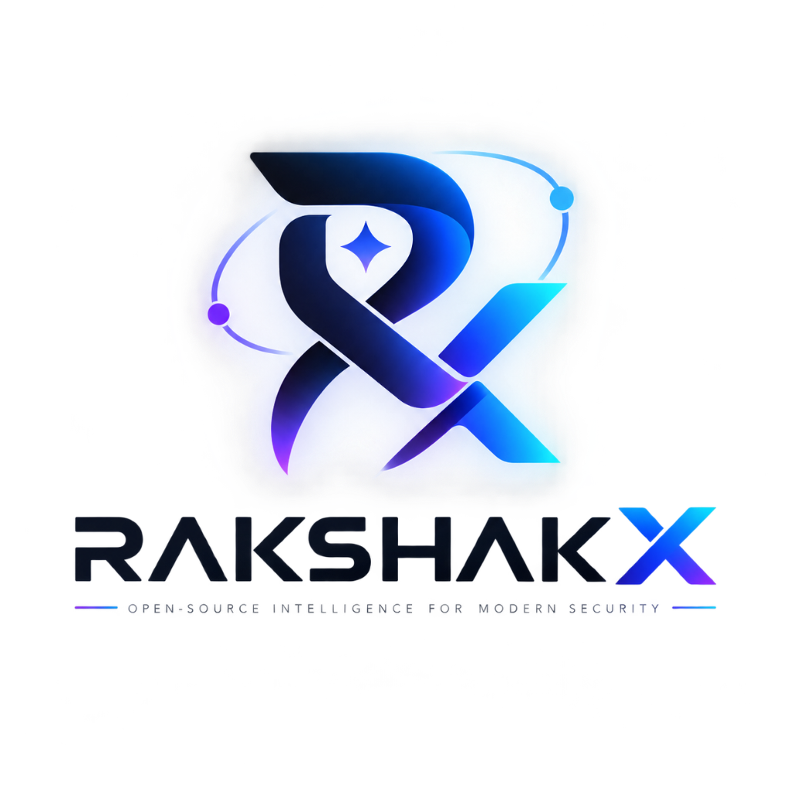

<p align="center">
  
</p>

<p align="center">
  <h1 align="center">RakshakX (Rakshak AI)</h1>
  <p align="center">
    <strong>Open-Source & Community Edition of Trinetra AI</strong>
    <br />
    Designed & Architected by <strong>Rudraksh AGI</strong> · Proprietor: <strong>Aditya Kumar Mishra</strong>
    <br />
    <em>Autonomous Multi-Agent AI Cybersecurity & Penetration Testing Toolkit.</em>
  </p>
</p>

<p align="center">
  <a href="LICENSE"></a>
  <a href="#"></a>
  <a href="#"></a>
  <a href="#"></a>
  <a href="#"></a>
  <a href="#"></a>
</p>

---

## 📖 Table of Contents

- [About RakshakX & Trinetra AI](#-about-rakshakx--trinetra-ai)
- [Key Use Cases](#-key-use-cases)
- [Core Architecture & Capabilities](#-core-architecture--capabilities)
- [Quickstart Guide (1-Command Launcher)](#-quickstart-guide)
- [Configuring LLMs & AI Providers](#-configuring-llms--ai-providers)
- [MCP Bridge (Antigravity & OpenCode Integration)](#-mcp-bridge-antigravity--opencode-integration)
- [Giving Commands to the AI](#-giving-commands-to-the-ai)
- [Enterprise Reporting & Compliance](#-enterprise-reporting--compliance)
- [Repository Structure](#-repository-structure)
- [Contributing](#-contributing)
- [License & Terms of Use](#-license--terms-of-use)

---

## 🛡️ About RakshakX & Trinetra AI

**RakshakX (Rakshak AI)** is the official open-source, community edition of **Trinetra AI**, designed and developed by **Rudraksh AGI** under the leadership of proprietor **Aditya Kumar Mishra**.

Traditional vulnerability scanners produce **80%+ false positive rates**, miss stateful business logic vulnerabilities, and burden developers with noisy reports. RakshakX redefines modern security assessment by combining multi-agent autonomous reasoning with deterministic sandbox reproduction.

### The RakshakX Core Principles:
1. **Evidence Before Confidence**: *"PoC or it didn't happen."* Findings are never accepted merely from LLM hallucination or static pattern matching. A vulnerability is only confirmed when the agent executes a programmatically reproducible exploit inside the isolated sandbox.
2. **True Multi-Agent Specialization**: A hierarchical reasoning cluster where a **Root Orchestrator** maps the scope and delegates specialized domains to focused child subagents (*Auth Specialist*, *SQLi Prober*, *Concurrency Specialist*, *SSRF Specialist*).
3. **Full Network & AST Observability**: Transparently captures every HTTP request via a local **Caido HTTP proxy sidecar** and queries traffic using GraphQL / HTTPQL.
4. **Token Resilience**: Long assessments compress 100+ conversation turns into structured `<conversation-checkpoint>` snapshots without losing attack surfaces or active credentials.

---

## 🎯 Key Use Cases

| Use Case | Input Scope | Execution Lifecycle | Output Artifacts |
| :--- | :--- | :--- | :--- |
| **Black-Box Web Pentesting** | `https://target.app` | Active recon, parameter mining, multi-agent probing, empirical PoC reproduction. | Executive PDF, SARIF 2.1.0, Technical Markdown |
| **White-Box Source Code Audit** | `/path/to/repo` | Tree-Sitter AST parsing, Semgrep taint tracing, dangerous sink isolation, sandbox verification. | Line-annotated code diffs & patch suggestions |
| **Business Logic & Race Conditions** | Multi-step APIs | Multi-tenant boundary checks (IDOR), HTTP/2 single-packet bursts, coupon/balance race conditions. | Verified concurrency curl scripts & timing graphs |
| **DevSecOps CI/CD Gating** | Pull Requests | Ephemeral container triggered on git push, incremental scan on modified endpoints, PR blocking. | Native GitHub Security Center annotations |

---

## 📐 Core Architecture & Capabilities

```
+-----------------------------------------------------------------------------------------+
|                              RAKSHAKX MULTI-AGENT RUNTIME                               |
|                                                                                         |
|  +-----------------------------------------------------------------------------------+  |
|  |                     Root Orchestrator (Scope & Task Dispatcher)                   |  |
|  +-------------------------+-------------------------------+-------------------------+  |
|                            |                               |                            |
|                            v (Async Mailbox)               v (Async Mailbox)            |
|  +-------------------------+---------+   +-----------------+-------------------------+  |
|  |    JWT / Auth Specialist Subagent |   |    SQLi / Injection Prober Specialist     |  |
|  +-------------------------+---------+   +-----------------+-------------------------+  |
|                            |                               |                            |
+----------------------------+-------------------------------+----------------------------+
                             |                               |
                             v (Docker Process Exec Stream)  v
+-----------------------------------------------------------------------------------------+
|                          ISOLATED KALI LINUX SANDBOX CONTAINER                          |
|                                                                                         |
|  - Transparent Caido HTTP Proxy Daemon (`0.0.0.0:48080`, GraphQL Client)                |
|  - System-wide Proxy Environment (`/etc/profile.d/proxy.sh`, NSS Root CA trust)         |
|  - Toolchain: Nmap, Nuclei, Sqlmap, FFuF, Semgrep, TruffleHog, Tree-Sitter              |
|  - Automated Headless Chromium Browser (`agent-browser`)                                |
|  - Spilled Output Store (`/workspace/.rakshak/spill/`)                                  |
+-----------------------------------------------------------------------------------------+
```

### 1. Multi-Agent Reasoning & Mailbox Coordination
- Child subagents execute in their own isolated reasoning contexts.
- Asynchronous mailboxes allow the Root Orchestrator and human operators to deliver real-time steering instructions mid-scan without blocking execution.

### 2. Isolated Kali Linux Container Sandbox
- Runs inside `containers/Dockerfile` with Root CA certificates pre-injected into Python `certifi`, Node.js, and browser NSS databases.
- Includes pre-configured tools: `nmap`, `nuclei`, `sqlmap`, `ffuf`, `semgrep`, `trufflehog`, `tree-sitter`, and `agent-browser`.

### 3. Caido Proxy & HTTPQL Observability
- All network requests made by tools or agents route through an embedded Caido proxy on port `48080`.
- Agents query raw request/response logs using GraphQL and HTTPQL to analyze auth flows and sensitive response leaks.

### 4. Modular Offensive Skills Catalog
Dynamic offensive playbooks loadable on-demand via `load_skill()`:
- `jwt_attacks.md`: RS256 to HS256 algorithm confusion, `none` algorithm, weak secret cracking.
- `idor_auth_bypass.md`: Horizontal/vertical privilege escalation, tenant boundary bypass.
- `sqli_methodology.md`: Boolean-blind, time-based, error-based SQL injection automation.
- `ssrf_exploitation.md`: Cloud metadata (`169.254.169.254`), DNS rebinding, internal loopback pivots.
- `race_conditions.md`: HTTP/2 single-packet burst testing, coupon double-redemption, balance races.
- `xss_workflow.md`: Stored/Reflected DOM XSS with headless browser execution proof.
- `rce_chains.md`: Command injection, unsafe deserialization, template injection (SSTI).

### 5. Output Spillway & Context Compaction
- Massive tool outputs (50,000+ lines from Nmap / FFuF) are bounded and spilled to disk (`/workspace/.rakshak/spill/`), providing the LLM with a 100-line preview and file pointer.
- Checkpoint engine compresses older conversational turns into dense `<conversation-checkpoint>` structures when context approaches 128k/200k token limits.

---

## 🚀 Quickstart Guide

### Prerequisites
- **Python**: 3.11 or higher
- **Node.js**: 18 or higher (with `npm`)
- **Docker**: For running the isolated Kali Linux sandbox

### 1. Clone & Install Dependencies

```bash
# Clone the repository
git clone https://github.com/rakshakx/rakshakx.git
cd rakshakx

# Install Python backend dependencies
pip install -r requirements.txt
pip install psutil reportlab

# Install React web console dependencies
cd web
npm install
cd ..
```

### 2. Launch the Unified Platform (1 Single Command)

Run the root launcher to boot the **Backend REST API (8080)**, the **React Console UI (3000)**, and the **MCP Bridge** simultaneously:

```bash
python launch.py
```

Open your browser at:
👉 **[http://localhost:3000](http://localhost:3000)**

---

## 🤖 Configuring LLMs & AI Providers

RakshakX is model-agnostic and connects to any cloud or local LLM via LiteLLM.

### Option A: Direct in the UI (Easiest)
1. Open the Web Console at `http://localhost:3000`.
2. Click **`LLM & API Settings`** in the left sidebar.
3. Select your provider:
   - **OpenAI**: `openai/gpt-4o`, `openai/o3-mini`
   - **Anthropic Claude**: `anthropic/claude-3-7-sonnet`, `anthropic/claude-3-5-sonnet`
   - **Google Gemini**: `gemini/gemini-2.5-pro`, `gemini/gemini-2.0-flash`
   - **Ollama (Local / Open-Source)**: `ollama/deepseek-r1`, `ollama/llama3.3` (Base URL: `http://localhost:11434`)
   - **OpenRouter / Groq / Custom LiteLLM**
4. Enter your API Key and click **"Save LLM Settings"** (automatically persisted in `rakshak.config.json`).

### Option B: Terminal Environment Variables

```bash
# OpenAI
export OPENAI_API_KEY="sk-..."
export RAKSHAK_LLM__MODEL="openai/gpt-4o"

# Anthropic Claude
export ANTHROPIC_API_KEY="sk-ant-..."
export RAKSHAK_LLM__MODEL="anthropic/claude-3-7-sonnet"

# Google Gemini
export GEMINI_API_KEY="..."
export RAKSHAK_LLM__MODEL="gemini/gemini-2.5-pro"

# Local Ollama DeepSeek R1 (No API key needed)
export RAKSHAK_LLM__MODEL="ollama/deepseek-r1"
export RAKSHAK_LLM__API_BASE="http://localhost:11434"
```

---

## 🔌 MCP Bridge (Antigravity & OpenCode Integration)

If you are using **Google Antigravity IDE**, **OpenCode**, **Claude Desktop**, or **Cursor**, you do **NOT** need to configure separate API keys. RakshakX provides a native **Model Context Protocol (MCP)** server so your active IDE agent can control RakshakX pentest tools directly.

### Step 1: Add RakshakX to your `mcp_config.json`

```json
{
  "mcpServers": {
    "rakshakx": {
      "command": "python",
      "args": ["-m", "rakshak.mcp.server"]
    }
  }
}
```

### Step 2: Use in your IDE Chat
Simply prompt your IDE assistant:
- *"Antigravity, launch a RakshakX security assessment on https://example.com and check for authentication vulnerabilities."*
- *"List verified findings and reproduction PoCs from the latest RakshakX scan."*

---

## ⚡ Giving Commands to the AI

| Interface | Where to Find | Description |
| :--- | :--- | :--- |
| **Dashboard AI Command Bar** | Dashboard Overview (Top) | Type natural language directives (`Assess auth workflows on https://example.com for JWT and IDOR`) and click **"Execute AI Task"**. |
| **New Scan Creator** | `New Scan` Tab | Specify Target Scope, select Black Box / White Box mode, toggle Recon/PoC modules, and enter detailed custom AI directives. |
| **Mid-Scan Steering Mailbox** | `Agent Topology` Tab | Send real-time high-priority steering instructions directly to the active Root Orchestrator while a scan is running. |
| **MCP IDE Agent** | Antigravity / OpenCode | Speak naturally to your IDE assistant to trigger scans and inspect findings. |
| **CLI Runner** | Terminal | `python -m rakshak.main --target https://example.com --mode blackbox --prompt "Audit payment API"` |

---

## 📊 Enterprise Reporting & Compliance

RakshakX includes 3 production-ready security assessment report templates:

1. **OASIS SARIF 2.1.0 (`sarif.json`)**:
   - Industry-standard format for static/dynamic findings.
   - Native integration with **GitHub Code Scanning**, **GitLab Security Dashboard**, and **SonarQube**.
2. **Executive PDF Pentest Report (`report.pdf`)**:
   - Styled PDF report generated with ReportLab.
   - Executive summaries, CVSS 3.1 severity breakdown tables, attack surface metrics, and strategic remediation roadmaps.
3. **Developer Technical Markdown (`report.md`)**:
   - Actionable markdown document containing raw `curl` reproduction commands, impacted endpoints, CWE references, and source code diff patches.

Download all reports directly with one click from the **`Compliance Reports`** tab in the Web Console!

---

## 📁 Repository Structure

```
RakshakX/
├── containers/
│   ├── Dockerfile                             # Isolated Kali Linux Docker sandbox definition
│   └── docker-entrypoint.sh                   # Sandbox bootstrap & Caido proxy init
├── docs/
│   └── assets/logo.png                        # Official RakshakX / Rudraksh AGI brand logo
├── rakshak/
│   ├── core/
│   │   ├── agents.py                          # AgentCoordinator & async mailbox runtime
│   │   ├── execution.py                       # Subagent process execution
│   │   ├── paths.py                           # Directory resolution & artifact persistence
│   │   └── sessions.py                        # SQLite session persistence
│   ├── interface/
│   │   └── viewer/server.py                   # Backend REST API & Live Telemetry Server (8080)
│   ├── llm/
│   │   └── compaction.py                      # <conversation-checkpoint> compression
│   ├── mcp/
│   │   └── server.py                          # Stdio JSON-RPC 2.0 MCP Bridge Server
│   ├── report/
│   │   ├── dedupe.py                          # Composite hash vulnerability deduplication
│   │   ├── pdf_writer.py                      # ReportLab Executive PDF generator
│   │   ├── sarif.py                           # OASIS SARIF 2.1.0 generator
│   │   └── state.py                           # Report data models & Markdown generator
│   ├── skills/
│   │   └── vulnerabilities/                   # 7+ Offensive playbooks (JWT, IDOR, SQLi, etc.)
│   └── tools/
│       ├── proxy/tools.py                     # Caido GraphQL & HTTPQL querying tools
│       ├── reporting/tool.py                  # CVSS 3.1 scoring tool
│       └── output_store.py                    # Output bounding spillway store
├── web/                                       # Enterprise React + TypeScript UI Console (3000)
│   ├── public/logo.png                        # Web favicon & brand assets
│   ├── src/
│   │   ├── App.tsx                            # Root router & real-time polling controller
│   │   ├── components/app/                    # Dashboard, New Scan, Findings, Settings, Reports
│   │   ├── components/landing/                # 16-section SaaS landing page
│   │   └── types/index.ts                     # TypeScript data interfaces
│   ├── package.json
│   └── vite.config.ts
├── launch.py                                  # Unified 1-command platform runner
├── rakshak.config.json                        # Local LLM & budget configuration
├── README.md
└── LICENSE                                    # Rudraksh AGI Community License (Non-Commercial, Share-Alike)
```

---

## 🤝 Contributing

Contributions are warmly welcomed! RakshakX is built by the community for the community.
- To author a new offensive skill playbook, add a markdown file to `rakshak/skills/vulnerabilities/` following the established frontmatter format.
- Please review [CONTRIBUTING.md](CONTRIBUTING.md) for pull request guidelines and test suite commands (`pytest tests/`).

---

## ⚖️ License & Terms of Use

RakshakX is licensed under the **Rudraksh AGI Open Community License (Non-Commercial, Share-Alike, Mandatory Attribution)**:

- **Copyright (c) 2026 Rudraksh AGI**
- **Proprietor & Original Author**: **Aditya Kumar Mishra**
- **Project Lineage**: Community Edition of **Trinetra AI**

### Mandatory License Terms:
1. 🔓 **Freedom to Use & Modify**: Anyone may freely use, inspect, study, and modify the source code for personal, educational, research, and authorized security assessments.
2. 🔄 **Mandatory Share-Alike (Public Availability)**: If you modify, adapt, or build upon this software and distribute or host it, you **MUST make your modified version publicly available as open-source** under the exact same license terms.
3. 🏷️ **Mandatory Attribution**: You must retain and conspicuously display credit to **Rudraksh AGI** and **Aditya Kumar Mishra** in all copies, modified forks, documentation, and user interfaces.
4. 🚫 **Non-Commercial Restriction (No Reselling)**: You are **strictly NOT allowed to sell**, commercialize, paywall, or license this software or any derivative works for monetary profit without prior written authorization from the proprietor.

> **⚠️ Ethical Use Disclaimer**: RakshakX is designed **strictly for authorized penetration testing, security research, and developer vulnerability remediation**. Always obtain explicit written authorization before scanning any target network or application. The authors and contributors assume no liability for misuse.
